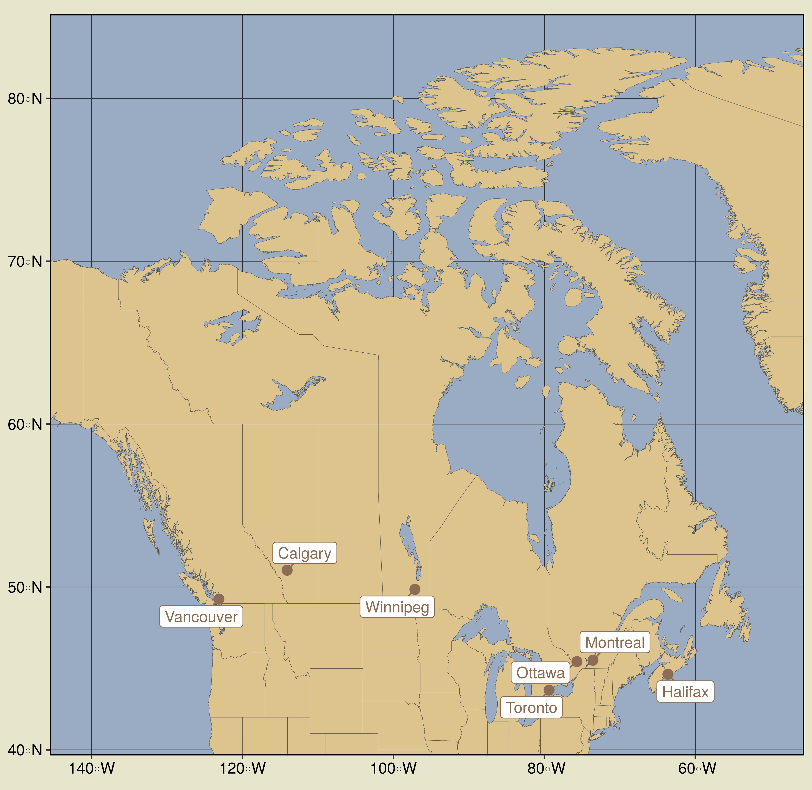
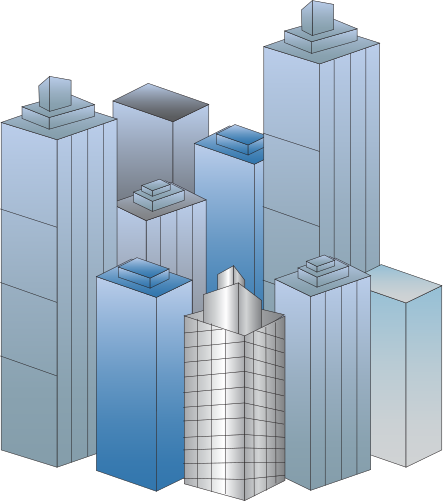
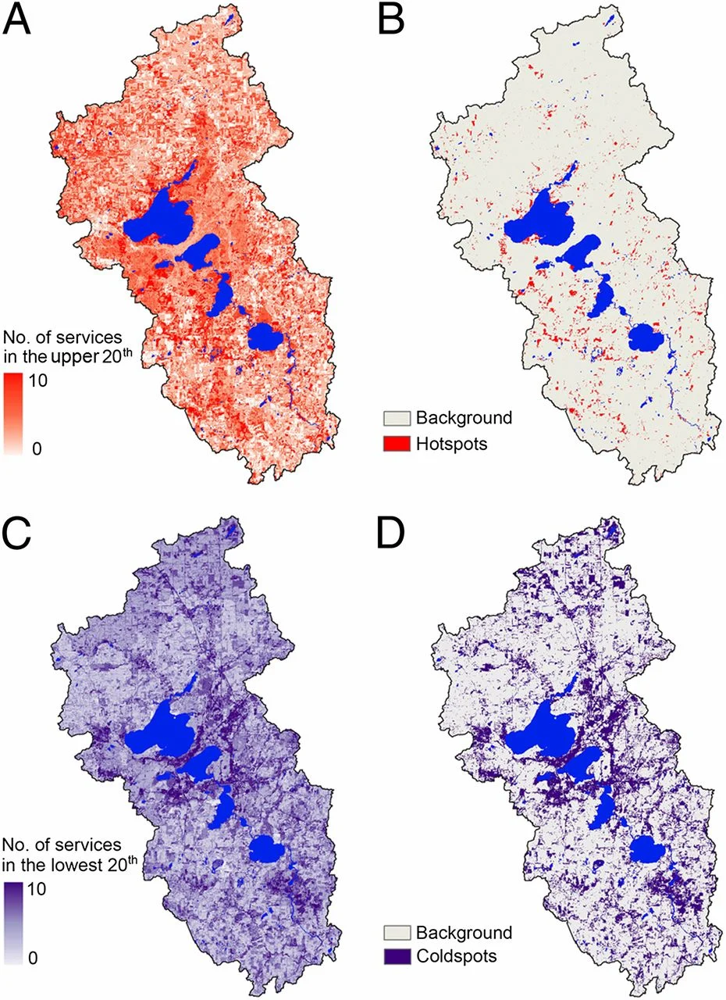

```{r, echo = F}
library(emo)
```

class: introduction

# Thank You 

.pull-left[
```{r, echo = F, fig.align='center', fig.retina=2.5}
knitr::include_graphics("Summer-August-5-2021.jpg")
```
]

.pull-right[
```{r, echo = F, fig.align='center', fig.retina=2.5}
knitr::include_graphics("zule-december.jpg")
```
]

???

I want to start this presentation with a HUGE thank you to the ZULE lab and my coauthors. I also want to acknowledge that I am doing this work on the stolen land of many Indigenous peoples including the Haudenosaunee, Mohawk, and Anishinaabeg peoples. I use this land acknowledgement not as a final destination or a checkmark on a list but as a constant reminder to engage with and grapple with how my science as a settler on this land is or is not reckoning with colonization and its ongoing presence.


---
class: mainconcepts 
# .small[The Urban Ecosystem] 

```{r, echo = F, fig.align='center'}

```

.footnote[
[1]: Adapted from Pickett et al. 2017, [Urban Ecosystems](http://link.springer.com/10.1007/s11252-016-0574-9)
]


???
Okay so we are going to start with a little intro into some of the main concepts that underpin my proposal. First, perhaps unsurprisingly, is the urban ecosystem.  Traditionally, we have thought of ecosystems in ecology as the existence and interactions between biotic and physical elements - as we see here


---
class: mainconcepts 
# .small[The Urban Ecosystem] 

```{r, echo = F, fig.align='center', fig.retina=2.5}
knitr::include_graphics("adapted-pickett.png")
```

.footnote[
[1]: Adapted from Pickett et al. 2017, [Urban Ecosystems](http://link.springer.com/10.1007/s11252-016-0574-9)
]


???
However, we can conceptualize the difference between "traditional" ecosystems and urban ecosystems through the additions of two types of elements - built and social. Built being infrastructure that humans create such as roads and buildings, and social being the inherent social structures and interactions that occur between humans.

---
class: mainconcepts 

# .small[The Urban Forest & it's Composition]
- Urban forest is part of the biotic elements of cities
- Differences in urban forest composition change ecosystem functioning
```{r, echo = F}
knitr::include_graphics("composition.jpg")
```

.footnote[
[2]: Aronson et al. 2017, [Frontiers in Ecology and the Environment](https://esajournals-onlinelibrary-wiley-com/doi/full/10.1002/fee.1480?casa_token=pfUkQEswVAMAAAAA%3ApcP-dwTjzK9rumqs4Vg4y_VpVF0SClhwurbbTvsMTvMr_obS1DGbWBhufnRWabViUVW7zciXJuqB0o-A)
]

???

An important part of the biotic elements in cities is the urban forest. We can think of the urban forest as all trees, shrubs, and greenspaces within an urban area and it is part of the biotic elements found within cities. The urban forest is critical to human well-being and different components of the urban forest function extremely differently. For example, we can imagine the forest remnant pictured on the far left providing really different ecosystem functions than a managed park or a green roof, on the right. A remnant forest may provide better habitat for wildlife and support more native species. Whereas a managed park may provide more mental health benefits and a green roof may add green space to an extremely dense environment. However, they can also all decrease air temperatures and store carbon, although albeit with different capacities. 

---
class: mainconcepts

# .small[Ecosystem Services]
- The benefits that humans derive from nature 

```{r, echo = F, warning = F, message=F,  fig.align='center',fig.retina = 2.5}
library(data.table)
library(ggplot2)
library(ggrepel)

demand <- rep(0,101)
x <- seq(0, 100, by = 1)
pressure <- dnorm(x, mean = 50, sd = 10)
capacity <- (dnorm(x, mean = 75, sd = 15))*-1

df <- data.frame(demand = demand, pressure = pressure, capacity = capacity, time = 1:101)
df <- melt(df ,  id.vars = 'time', variable.name = 'ES')
df$ES <- as.factor(df$ES)

data_label <- df
data_label$label <- NA
data_label$label[which(data_label$time == max(data_label$time))] <- data_label$ES[which(data_label$time == max(data_label$time))]
data_label['label'][data_label['label'] == '1'] <- 'demand'
data_label['label'][data_label['label'] == '2'] <- 'pressure'
data_label['label'][data_label['label'] == '3'] <- 'capacity'

cols <- c('#9cc184', '#447243', '#1e3d14')

ggplot(aes(x = time, y = value, colour = ES), data = data_label) + 
  geom_line(size = 1) + 
  scale_colour_manual(values = cols) + 
  geom_label_repel(aes(label = label),
                   nudge_x = 3,
                   na.rm = TRUE) +
  theme_classic() + 
  xlab(label = "Time") + 
  ylab(label = " ") + 
  xlim(0,115) + 
  theme(axis.text.x = element_blank(),
        axis.ticks.x = element_blank(),
        axis.text.y = element_blank(),
        axis.ticks.y = element_blank(),
        legend.position = "none",
        panel.background = element_rect(fill = "#e7e5cc", color = NA),
        plot.background = element_rect(fill = "#e7e5cc", color = NA)
        )
```

.small[.footnote[
[3]: Adapted from Villamagna   
et al. 2013. [Ecological Complexity](https://linkinghub.elsevier.com/retrieve/pii/S1476945X1300055X)
]]


???

Now, when we discuss all the benefits that we receive from the urban forest (and other biotic elements within our cities), we often refer to the benefits as "ecosystem services".  In my thesis, and proposal, I really focus exclusively on ecosystem service capacity - which is the total potential of an ecosystem to produce a service. However, factors such as pressure and demand inherently influence both capacity, and importantly, flow of ecosystem services. 

We can use this diagram to imagine a system where demand for ecosystem services is kept constant through time. However, we see a pressure, a physical stressors acting on an ecosystem such as a storm increasing, which subsequently causes a decrease in the capacity perhaps due to tree death/removal. This example demonstrates that each part of the ecosystem services framework is really imprtant to understand if we want to understand the actual flow and delivery of ES. However, its also really complex and in my thesis I have chosen to focus on specifically capacity because it underlines it all and is the most tied to ecology - because with no capacity there can be no provision


---
class: mainconcepts 

# .small[Inequity]

```{r,echo=F, fig.align='center'}
knitr::include_graphics("racism.jpeg", dpi = 200)
```

.footnote[ [4]: Schell et al. 2020. [Science](https://www.sciencemag.org/lookup/doi/10.1126/science.aay4497)
]

???

Importantly, when we conceptualize ecosystem services provided by the urban forest, we have to understand that these biotic elements are inherently intertwined with the physical, built, and social elements of our cities as well. Thus, we can understand that the inequity built into the social elements of our cities underpins the built, natural, and physical elements as well, including the urban forest. And indeed if we **don't** try to incorporate inequities into our science, we will never be ably to fully understand our ecosystems. For example, urban greenspaces and parks provide many benefits to urban residents, including improving mental health, providing a sense of community, reducing temperatures, and during covid providing a safe space t socialize. However, overall park area as well as park quality decreases as you increase the proportion of racialized people within a neighbourhood. This is important of course if we are interested in inequity and environmental justice. But it is also key to understanding the distribution and composition of the urban forest. Without understanding and incorporating the piece of inequity, I as a scientist would never be able to fully understand this ecosystem.

---

class: mainconcepts

# .small[Spatial Heterogeneity]

<center> 
```{r echo=F, message=F, warning=FALSE, fig.align='center'}
library(mapview)
library(raster)
lst <- raster("LSTMeanExample.tif")
mapview(lst, alpha.regions = 0.6)
```
</center>

.footnote[
[5]: Pickett et al. 2017, [Urban Ecosystems](http://link.springer.com/10.1007/s11252-016-0574-9)
]

???

And so if we conceptualize inequity as varying across space we can start to imagine spatial heterogeneity. Now, of course, there are other factors that are causing spatial heterogeneity - going back to the physical, biotic, and built elements all intertwined. All of these complex layers work together to create cities which are a uniquely fine-scale spatially heterogeneous system. And this spatial heterogeneity occurs on many scales - we can see on this slide that land surface temperature varies on a fine-scale, along a single street for example - but it also varies across neighbourhoods, and we can of course imagine it varying across cities. Spatial heterogeneity is so important when considering our cities

---
class: question

# .small[What are the cross-city drivers of ecosystem services?]

```{r, echo = F, fig.align='center', out.width="60%"}

```

???


This study is driven by the question - what are the cross-city drivers of regulatory ecosystem service capacity provided by the urban forest in Canadian temperate cities? And I think this is an interesting question because although there has undoubtedly been a lot of work regarding ecosystem services in urban settings - there hasn't been many studies that try to take this multi-city, multi-scale approach. And I think it is an interesting approach to take because if there are indeed factors, or drivers, that consistently influence ecosystem service capacity - regardless of scale or city - we can use that knowledge to more effectively plan and manage for ecosystem services.

---
class: hypotheses

# .small[Cross-City vs City-Specific]

**Hypotheses** 

--

*Cross-City Drivers*: We hypothesize that there will be some drivers that influence ecosystem service capacity in the same direction across scales/cities. For example:  

- tree size .large[`r emo::ji("deciduous_tree")`].small[`r emo::ji("deciduous_tree")`]
- tree density .large[`r emo::ji("house_with_garden")` `r emo::ji("office_building")`]
- impervious surface .large[`r emo::ji("bricks")`] 

--

*City-Specific Drivers*: We hypothesize that there will be some drivers that change magnitude and direction in how they influence ecosystem service capacity across scales/cities. For example: 

- tree diversity .large[`r emo::ji("deciduous_tree")``r emo::ji("palm_tree")``r emo::ji("evergreen_tree")`]
- building function .large[`r emo::ji("house_with_garden")` `r emo::ji("office_building")`]
- class/income .large[`r emo::ji("bill")`]

???

This chapter's hypotheses are really driven by this kind of cross-city vs city-specific framework, with the idea that there will be some drivers, for example tree size, tree density, or impervious surfaces, that consistently influence ecosystem services. So bigger trees mitigate higher temperatures and store more carbon, regardless of what city you are in or what scale you look at. However, it should be noted that I do not expect the magnitude of the effect to stay the same, just direction. In contrast, we also expect to have some city or scale-specific drivers. These are factors, potentially such as tree diversity, building function, or median income, that may influence ecosystem service capacity differently depending on the scale or city you are looking at. We might imagine that a more species rich forest might increase capacity to store carbon at a city scale but not a street scale, or that different cities may have different approaches to tree planting across different building functions - e.g., commercial lots look different in Toronto than Halifax.

---
class:hypotheses

# .small[Our Approach]

--
.left-column[
- Three scales:  

```{r, echo = F, fig.align='center', out.width="30%"}
  
```


```{r, echo = F, fig.align='center', out.width="30%"}
knitr::include_graphics("favela-in-brazil.png")  
```


```{r, echo = F, fig.align='center', out.width="30%"}
knitr::include_graphics("street.jpg")  
```
]


???

So with all that in mind, my first chapter will take a multi-scale, multi-service, multi-city approach to this question. Using seven cities across Canada and three scales - street, neighbourhood, and whole city, we will test if there are cross-city drivers.


--

.right-column[
- Three ecosystem services: .large[`r emo::ji("thermometer")`, `r emo::ji("factory")`, `r emo::ji("seedling")`]]

--

.right-column[
- Ecological drivers: .large[`r emo::ji("deciduous_tree")``r emo::ji("palm_tree")``r emo::ji("evergreen_tree")`,].large[`r emo::ji("deciduous_tree")`].small[`r emo::ji("deciduous_tree")`, `r emo::ji("national_park")``r emo::ji("road")`]]

--

.right-column[
- Infrastructure drivers: .large[`r emo::ji("straight_ruler")`,] .large[`r emo::ji("bricks")`, `r emo::ji("national_park")`, ].large[`r emo::ji("city")`,].large[ `r emo::ji("house_with_garden")` `r emo::ji("office_building")`,] .large[`r emo::ji("office_building")`].smaller[`r emo::ji("office_building")`]]

--

.right-column[
- Sociodemographic drivers: .large[`r emo::ji("parents")`, `r emo::ji("bill")`, `r emo::ji("graduation_cap")`, `r emo::ji("light_skin_tone")``r emo::ji("dark_skin_tone")``r emo::ji("medium_skin_tone")`, `r emo::ji("house")``r emo::ji("castle")` ]]

.footnote[ .small[ [6]: [IAN](ian.umces.edu/media-library) & [VectorStock](https://cdn4.vectorstock.com/i/1000x1000/15/73/city-road-urban-street-vector-23001573.jpg)
]]

???

The drivers I am testing can be separated into three categories - ecological: tree diversity, tree size, and tree density, built infrastructure/urban form: road size, impervious surface, green area, building density, building height, building function, and sociodemographic; population density, income, educatioon level, visible minorities, immigration, and dwelling type

---
class:results

# .small[Chapter 1: Cross-City Drivers of Ecosystem Services]

**Proposed Analysis** 


```{r,echo = F, eval = T, fig.align='center', out.width='85%'}

knitr::include_graphics("ch1analysis.png")

```

???

The conceptualization of the analysis for this chapter gets a little bit complicated when you try to hold it all in your brain at once. And I am super open to a discussion regarding this, I would love to get everyone's opinions and insights. On this slide, I am presenting one possible approach that I have started to think about. Basically here, I am depicting some hypothetical cross-city drivers (x axis), at the neighbourhood scale, for all three ecosystem service capacities (y axis), for three hypothetical cities. Here, I have the response variables separated obviously, but I would also be looking at the interaction between these three ecosystem service capacities through a kind of spatial hotspot analysis. I have also considered using a multiple linear regression with all three response variables included in the same model so that we can see the interactions between them, since they are of course related and causally tied to one another. We could also imagine this graph with only one driver and each column being a different scale, street vs neighbourhood vs city. Basically, modelling the variables and trying to tease out these common relationships is the goal. But I haven't nailed down exactly the approach I will be taking.

---
class:results

# .small[Chapter 1: Cross-City Drivers of Ecosystem Services]

**Proposed Analysis** 


```{r,echo = F, eval = T, fig.align='center', out.width='40%', out.height='40%'}

```

.footnote[ .small[ [7]: [Qiu & Turner](https://www.pnas.org/doi/10.1073/pnas.1310539110)] ] 

???

Alternatively, I think using a hot-spot/cold-spot approach to the ecosystem service capacities and trying to pull out if there are common characteristics across these hot or cold spots could be a better way to go about this - that begins to address some of the issues of confounding variables that pop up when we start modelling. This paper models 10 ecosystem services and identifies where 6 or more ES are in their upper or lower 20th percentile and labels those places as hotspots and coldspots. This also gets at the ideas of synergies and trade-offs between the ES, instead of modelling them separately.  

10 services include: crop production, pasture production, freshwater supply, carbon storage, groundwater quality, surface water quality, soil retention, flood regulation, forest recreation, hunting recreation

---
class:results

# .small[Why Does it Matter? + Stay Tuned!]

.pull-left[
```{r,echo = F, eval = T, fig.align='center', out.width='40%', out.height='40%'}
knitr::include_graphics("frederickbackthen.png")
```
]

.pull-right[
```{r,echo = F, eval = T, fig.align='center', out.width='40%', out.height='40%'}
knitr::include_graphics("frederickbacknow.jpg")
```
]

.footnote[ .small[ [8]: [László Horváth](https://www.mindat.org/photo-506487.html)], [Tourisme Montréal](https://www.mtl.org/en) ] 

???
Cities across Canada are dynamic systems - evolving and changing all the time. In understanding the commonalities (and differences) of the factors that determine the ecosystem service capacity in our cities, we can more effectively plan and manage on large, landscape scales. We have a better baseline understanding when starting a project, which hopefully will allow us to design and live in cities that distribute ecosystem services effectively and equitably. 


---
class: results
background-image: url("urbantree.jpg")

# Questions


.footnotefinal["Le Plateau Montreal - Tree" by ra1000 is licensed under CC BY-NC-ND 2.0]


---

class: introduction

# .small[Research Gaps]

- "Despite the importance of historical and future urban growth as a driver of global change, the global impact on biodiversity remains unclear" - McDonald et al. 2020

--

- "Some of the most compelling, and as yet unanswered, questions that take a systems approach to understanding and quantifying ES:" - Bennett 2017
  - "How do multiple ES interact, and what do those interactions mean for ecosystem management?" 
  - "What is the role of historical legacies in the provision of ES today?"
  
--
  
- "central features of future urban ecological research should be synthesis, a complex-systems view, cross-city comparison at multiple scales, and inclusion of more disciplines that take advantage of emerging data sources, methods, and tools." - McPhearson et al. 2016

--

- "...the analysis of the distribution of ecosystem services needs to be developed further to fully address justice" - Ernstson 2013 

--

- "A more rigorous engagement between urban political ecology and the biophysical sciences, ..., would mark the outline of a very different kind of research agenda" - Gandy 2022

???

Here I have included some quotes from some of the foundational papers driving my research that kind of outline the gaps that I am trying to fill... We start with this McDonald paper that highlights the need for an improved understanding of urbanization and biodiversity. Followed by Elena Bennett's 2017 paper saying that some of the most compelling questions about ecosystem services are investigating how multiple ES interact and what do those interactions mean, as well as looking into the effect of historical legacies on ES. McPhearson et al outline the future of urban ecology should do cross-city comparisons at multiple scales, with multiple disciplines, using cutting edge tools. We have Ernstson saying that we need to further develop our understanding of the distribution of ecosystem services if we want to use this framework to address justice and injustice. And finally, we have Gandy outlining the gap that exists between urban political ecology and urban ecology, where if integrated, we could see really new and exciting research taking place.

---

class: introduction 

# Foundational Papers

1. **Wu** J (2014) Urban ecology and sustainability: The state-of-the-science and future directions. Landscape and Urban Planning 125:209–221. 

--

2. **Villamagna** AM, Angermeier PL, Bennett EM (2013) Capacity, pressure, demand, and flow: A conceptual framework for analyzing ecosystem service provision and delivery. 

--

3. **Pham** T-T-H, Apparicio P, Landry S, Lewnard J (2017) Disentangling the effects of urban form and socio-demographic context on street tree cover: A multi-level analysis from Montréal. Landscape and Urban Planning 157:422–433

--

4. **Schell** CJ, Dyson K, Fuentes TL, et al (2020) The ecological and evolutionary consequences of systemic racism in urban environments. Science 369

--

5. **Ossola** A, Cadenasso ML, Meineke EK (2021) Valuing the Role of Time in Urban Ecology. Front Ecol Evol 9:620620.

---

class: mainconcepts 

# .small[Chapter 1: Cross-City Drivers of Ecosystem Services]

**Causal Model - All Variables**

```{r, eval = T, message = F, echo = F, fig.align='center', fig.retina=2}
library(ggdag)
library(ggplot2)

dag <- dagify(
    ES ~ TDiv + TSiz + TDens + RSiz + Imp + BDens + BFunc + BHgt + PDens + Inc + PImm + PMin + DTyp,
    TDiv ~ BFunc + Inc + PImm + PMin + DTyp,
    TSiz ~ TDiv + TDens + RSiz + Imp + BDens + PDens + Inc + PImm + PMin + DTyp,
    TDens ~ TSiz + RSiz + Imp + BDens + BFunc + PDens + Inc + PImm + PMin + DTyp,
    RSiz ~ BDens + BFunc + PDens + DTyp, 
    Imp ~ TDens + RSiz + BDens + BHgt + DTyp,
    BDens ~ Inc + DTyp,
    PDens ~ BDens + BFunc + Inc + PImm + PMin + DTyp,
    Inc ~ PImm + PMin + DTyp,
    PImm ~ Inc + PMin,
    PMin ~ PImm + Inc,
    DTyp ~ PDens + PImm + PMin,
    outcome = "ES"
)
ggdag(dag) + 
  theme_dag_blank() + 
  theme(plot.background = element_rect(fill = "#e7e5cc", colour = NA))
```


---
class: mainconcepts 

# .small[Chapter 1: Cross-City Drivers of Ecosystem Services]
**Functional Groups**

```{r, echo = F, fig.align='center'}
knitr::include_graphics("paquette.jpg")
```

.footnote[
Paquette et al. 2021, [Urban Forestry & Urban Greening](https://doi.org/10.1016/j.ufug.2021.127157)]


---
class: mainconcepts 
# .small[Chapter 1: Cross-City Drivers of Ecosystem Services]

**Scale vs City** 

- Landscape vs local level effects 

- Drivers that vary across scales but consistently across cities 
  - e.g., air pollution mitigation + tree size
  - e.g., temperature mitigation + building height 

- Drivers that vary across cities but consistently across scales 
  - e.g., sociodemographic variables - effect often scales up but is dependent on local context 
