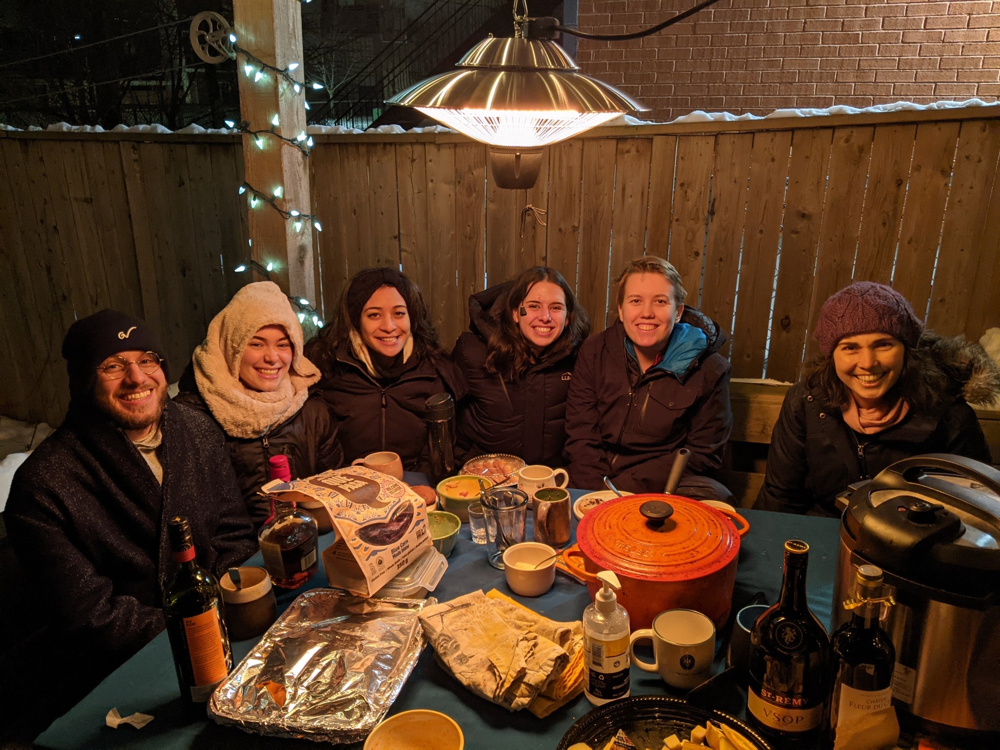
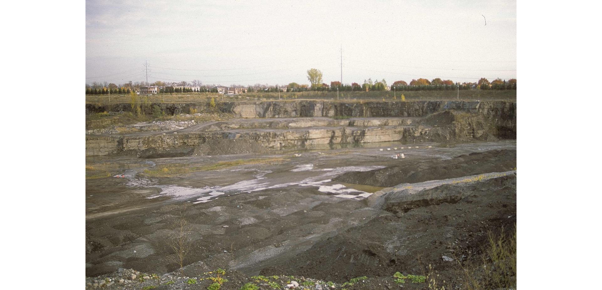
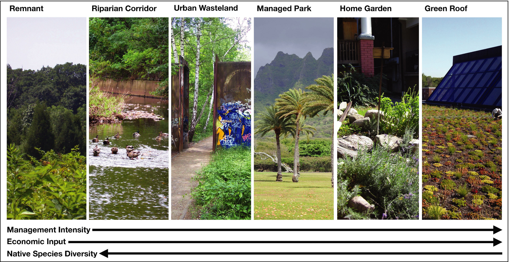
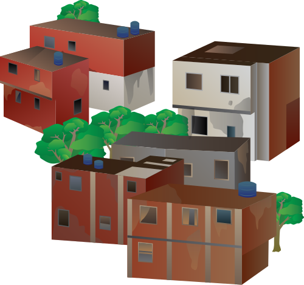
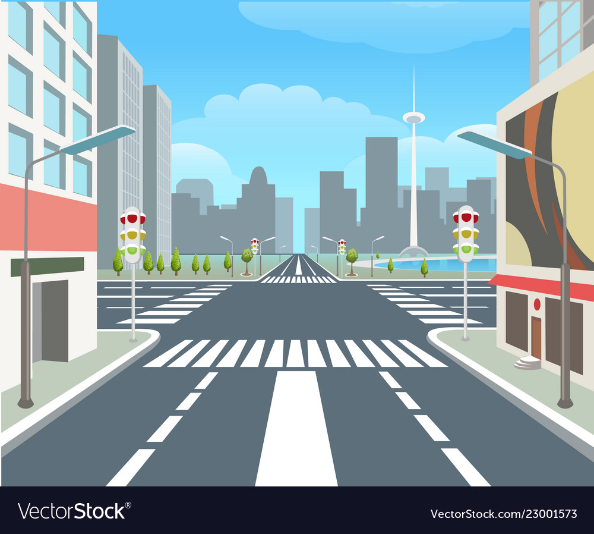
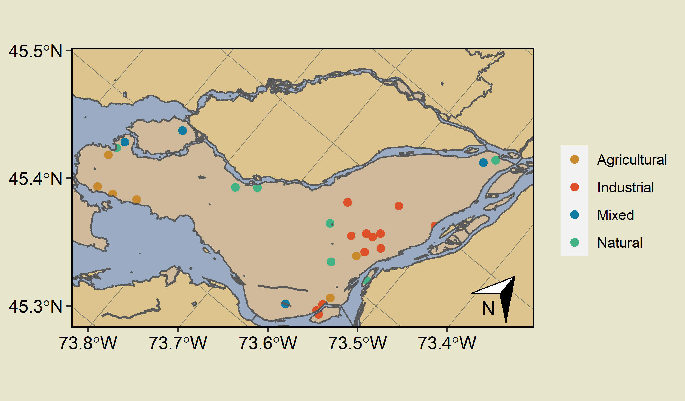
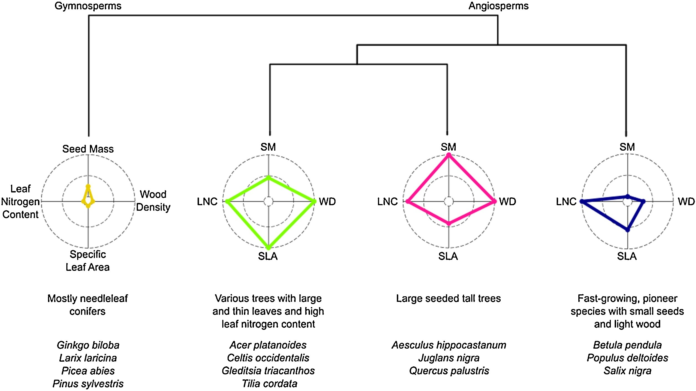

```{r, echo = F}
library(emo)
```

class: introduction

# Thank You 

.pull-left[
```{r, echo = F, fig.align='center', fig.retina=2.5}
knitr::include_graphics("Summer-August-5-2021.jpg")
```
]

.pull-right[
```{r, echo = F, fig.align='center', fig.retina=2.5}

```
]

???

I want to start this presentation with gratitude because although starting my PhD in a pandemic and only being at Concordia for a year and 4 months, I have so many people to thank. I first want to thank the cities and trees and all the people within and around them, they are so cool and inspire me to think about these things a lot and also allow me to have fun while doing this. HUGE thank you to the ZULE lab, they are in every single part of this proposal. Shout out to Kayleigh, who I think has read this more than anyone else but also Lingshan, Fatemeh, Emily, Katie, Nicole, Gail, Maya, Noa, and Serena for the endless edits. Thank you to Nicole and Lauren for helping me collect and clean data! Special thank you to Michael for edits as well as collaboration on the second chapter, and OF COURSE a huge thank you to Carly who has been a truly excellent supervisor up to this point and also helped me make my first friends in Montreal because she is so kind. I also want to thank my committee and examiners for spending time thinking about my project, that is extremely cool for me to have so many smart people think about my work and how to make it better. And finally, after all this gratitude I do want to acknowledge that I am doing this work on the stolen land of many Indigenous peoples including the Haudenosaunee, Mohawk, and Anishinaabeg peoples. I use this land acknowledgement not as a final destination or a checkmark on a list but as a constant reminder to engage with and grapple with how my science as a settler on this land is or is not reckoning with colonization and its ongoing presence.


---
class: mainconcepts 
# .small[The Urban Ecosystem] 

```{r, echo = F, fig.align='center'}
knitr::include_graphics("adapted-pickett-base.png")
```

.footnote[
[1]: Adapted from Pickett et al. 2017, [Urban Ecosystems](http://link.springer.com/10.1007/s11252-016-0574-9)
]


???
Okay so we are going to start with a little intro into some of the main concepts that underpin my proposal. First, perhaps unsurprisingly, is the urban ecosystem.  Traditionally, we have thought of ecosystems in ecology as the existence and interactions between biotic and physical elements - as we see here


---
class: mainconcepts 
# .small[The Urban Ecosystem] 

```{r, echo = F, fig.align='center', fig.retina=2.5}

```

.footnote[
[1]: Adapted from Pickett et al. 2017, [Urban Ecosystems](http://link.springer.com/10.1007/s11252-016-0574-9)
]


???
However, we can conceptualize the difference between "traditional" ecosystems and urban ecosystems through the additions of two types of elements - built and social. Built being infrastructure that humans create such as roads and buildings, and social being the inherent social structures and interactions that occur between humans.

---
class: mainconcepts 

# .small[Inequity]

```{r,echo=F, fig.align='center'}
knitr::include_graphics("racism.jpeg", dpi = 200)
```

.footnote[ [2]: Schell et al. 2020. [Science](https://www.sciencemag.org/lookup/doi/10.1126/science.aay4497)
]

???

Importantly, when we conceptualize urban ecosystems as the intersection between natural, physical, built, and social elements we can understand that the inequity built into the social elements of our cities underpins the built, natural, and physical elements as well. And indeed if we **don't** try to incorporate inequities into our science, we will never be ably to fully understand our ecosystems.

---

class: mainconcepts

# .small[Spatial Heterogeneity]

<center> 
```{r echo=F, message=F, warning=FALSE, fig.align='center'}
library(mapview)
library(raster)
lst <- raster("LSTMeanExample.tif")
mapview(lst, alpha.regions = 0.6)
```
</center>

.footnote[
[3]: Pickett et al. 2017, [Urban Ecosystems](http://link.springer.com/10.1007/s11252-016-0574-9)
]

???

And so if we conceptualize inequity as varying across space we can start to imagine spatial heterogeneity. Now, of course, there are other factors that are causing spatial heterogeneity - going back to the physical, biotic, and built elements all intertwined. All of these complex layers work together to create cities which are a uniquely fine-scale spatially heterogeneous system. And this spatial heterogeneity occurs on many scales - we can see on this slide that land surface temperature varies on a fine-scale, along a single street for example - but it also varies across neighbourhoods, and we can of course imagine it varying across cities. Spatial heterogeneity is so important when considering our cities

---
class: mainconcepts 

# .small[Temporal Heterogeneity]

```{r,echo=F, message = F, warning=F, fig.align='center'}

```


.footnote[ [4]:[László Horváth](https://www.mindat.org/photo-506487.html)]

???

Similarly important to spatial heterogeneity is temporal heterogeneity! We know that current functioning of our cities with respect to ecosystem services and other ecological processes is temporally heterogeneous, and specifically are influenced by legacy effects which are a form of temporal heterogeneity. Legacy effects occur when an event carries its effects across time. For example, we can imagine that a decision or event such as past land-use type could have legacy effects. So using a location as a landfill or quarry (or both)... 

---

class: mainconcepts 

# .small[Temporal Heterogeneity]
```{r,echo=F, message = F, warning=F, fig.align='center'}
knitr::include_graphics("frederickbacknow.jpg")
```


.footnote[[5]:[Tourisme Montréal](https://www.mtl.org/en)
]

???

May influence the subsequent functioning of that ecosystem through many legacy effects, even when the land use has changed to something else, perhaps a park - such as here in Frederick-Back

---
class: mainconcepts 

# .small[The Urban Forest & it's Composition]
- Urban forest is part of the biotic elements of cities
- Differences in urban forest composition change ecosystem functioning
```{r, echo = F}

```

.footnote[
[6]: Aronson et al. 2017, [Frontiers in Ecology and the Environment](https://esajournals-onlinelibrary-wiley-com/doi/full/10.1002/fee.1480?casa_token=pfUkQEswVAMAAAAA%3ApcP-dwTjzK9rumqs4Vg4y_VpVF0SClhwurbbTvsMTvMr_obS1DGbWBhufnRWabViUVW7zciXJuqB0o-A)
]

???

So - we have the urban ecosystem as a whole, inequity, spatial and temporal heterogeneity, all of these things come together when we start to think about the urban forest and how it is organized in time and space. We can think of the urban forest as all trees, shrubs, and greenspaces within an urban area and it is part of the biotic elements found within cities. The urban forest is critical to human well-being and different components of the urban forest function extremely differently. For example, we can imagine the forest remnant pictured on the far left providing really different ecosystem functions than a managed park or a green roof, on the right. A remnant forest may provide better habitat for wildlife and support more native species. Whereas a managed park may provide more mental health benefits and a green roof may add green space to an extremely dense environment. However, they can also all decrease air temperatures and store carbon, although albeit with different capacities. 

---
class: mainconcepts

# .small[Ecosystem Services]
- The benefits that humans derive from nature 

```{r, echo = F, warning = F, message=F,  fig.align='center',fig.retina = 2.5}
library(data.table)
library(ggplot2)
library(ggrepel)

demand <- rep(0,101)
x <- seq(0, 100, by = 1)
pressure <- dnorm(x, mean = 50, sd = 10)
capacity <- (dnorm(x, mean = 75, sd = 15))*-1

df <- data.frame(demand = demand, pressure = pressure, capacity = capacity, time = 1:101)
df <- melt(df ,  id.vars = 'time', variable.name = 'ES')
df$ES <- as.factor(df$ES)

data_label <- df
data_label$label <- NA
data_label$label[which(data_label$time == max(data_label$time))] <- data_label$ES[which(data_label$time == max(data_label$time))]
data_label['label'][data_label['label'] == '1'] <- 'demand'
data_label['label'][data_label['label'] == '2'] <- 'pressure'
data_label['label'][data_label['label'] == '3'] <- 'capacity'

cols <- c('#9cc184', '#447243', '#1e3d14')

ggplot(aes(x = time, y = value, colour = ES), data = data_label) + 
  geom_line(size = 1) + 
  scale_colour_manual(values = cols) + 
  geom_label_repel(aes(label = label),
                   nudge_x = 3,
                   na.rm = TRUE) +
  theme_classic() + 
  xlab(label = "Time") + 
  ylab(label = " ") + 
  xlim(0,115) + 
  theme(axis.text.x = element_blank(),
        axis.ticks.x = element_blank(),
        axis.text.y = element_blank(),
        axis.ticks.y = element_blank(),
        legend.position = "none",
        panel.background = element_rect(fill = "#e7e5cc", color = NA),
        plot.background = element_rect(fill = "#e7e5cc", color = NA)
        )
```

.small[.footnote[
[7]: Adapted from Villamagna   
et al. 2013. [Ecological Complexity](https://linkinghub.elsevier.com/retrieve/pii/S1476945X1300055X)
]]


???

Now, when we discuss all the benefits that we receive from the urban forest (and other biotic elements within our cities), we often refer to the benefits as "ecosystem services". Ecosystem services can be a useful framework and is often conceived of having multiple components. In my thesis, and proposal, I really focus exclusively on ecosystem service capacity - which is the total potential of an ecosystem to produce a service. However, factors such as pressure and demand inherently influence both capacity, and importantly, flow of ecosystem services. In this diagram we keep demand constant, but we can also imagine how demand may change over time and space. But we see pressure, the physical stressors acting on an ecosystem increasing - which causes a decrease in the capacity and indeed the flow of ecosystem services in this imagined system. Each component of the ecosystem service framework is important, but capacity underlines it all - because with no capacity there can be no provision

---
class: chapterone

# .small[Chapter 1: Cross-City Drivers of Ecosystem Services]

**Question:** What are the cross-city drivers of regulatory ecosystem service capacity provided by the urban forest in Canadian temperate cities?  

```{r, echo = F, fig.align='center', out.width="60%"}
knitr::include_graphics("chapter-1.png")
```

???

Alright so now we are getting into the actual proposed research in my proposal, beginning with a kind of zoomed out, spatial approach to ecosystem services. This chapter is driven by the question - what are the cross-city drivers of regulatory ecosystem service capacity provided by the urban forest in Canadian temperate cities? And I think this is an interesting question because although there has undoubtedly been a lot of work regarding ecosystem services in urban settings - there hasn't been many studies that try to take this multi-city, multi-scale approach. And I think it is an interesting approach to take because if there are indeed factors, or drivers, that consistently influence ecosystem service capacity - regardless of scale or city - we can use that knowledge to more effectively plan and manage for ecosystem services.

---
class: chapterone

# .small[Chapter 1: Cross-City Drivers of Ecosystem Services]

**Hypotheses** 

--

*Cross-City Drivers*: We hypothesize that there will be some drivers that influence ecosystem service capacity in the same direction across scales/cities. For example:  

- tree size .large[`r emo::ji("deciduous_tree")`].small[`r emo::ji("deciduous_tree")`]
- tree density .large[`r emo::ji("house_with_garden")` `r emo::ji("office_building")`]
- impervious surface .large[`r emo::ji("bricks")`] 

--

*City-Specific Drivers*: We hypothesize that there will be some drivers that change magnitude and direction in how they influence ecosystem service capacity across scales/cities. For example: 

- tree diversity .large[`r emo::ji("deciduous_tree")``r emo::ji("palm_tree")``r emo::ji("evergreen_tree")`]
- building function .large[`r emo::ji("house_with_garden")` `r emo::ji("office_building")`]
- class/income .large[`r emo::ji("bill")`]

???

This chapter's hypotheses are really driven by this kind of cross-city vs city-specific framework, with the idea that there will be some drivers, for example tree size, tree density, or impervious surfaces, that consistently influence ecosystem services. So bigger trees mitigate higher temperatures and store more carbon, regardless of what city you are in or what scale you look at. However, it should be noted that I do not expect the magnitude of the effect to stay the same, just direction. In contrast, we also expect to have some city or scale-specific drivers. These are factors, potentially such as tree diversity, building function, or median income, that may influence ecosystem service capacity differently depending on the scale or city you are looking at. We might imagine that a more species rich forest might increase capacity to store carbon at a city scale but not a street scale, or that different cities may have different approaches to tree planting across different building functions - e.g., commercial lots look different in Toronto than Halifax.

---
class:chapterone

# .small[Chapter 1: Cross-City Drivers of Ecosystem Services]
**Approach** 

--
.left-column[
- Three scales:  

```{r, echo = F, fig.align='center', out.width="30%"}
knitr::include_graphics("urban-city-2.png")  
```


```{r, echo = F, fig.align='center', out.width="30%"}
  
```


```{r, echo = F, fig.align='center', out.width="30%"}
  
```
]


???

So with all that in mind, my first chapter will take a multi-scale, multi-service, multi-city approach to this question. Using seven cities across Canada and three scales - street, neighbourhood, and whole city, we will test if there are cross-city drivers.


--

.right-column[
- Three ecosystem services: .large[`r emo::ji("thermometer")`, `r emo::ji("factory")`, `r emo::ji("seedling")`]]

--

.right-column[
- Ecological drivers: .large[`r emo::ji("deciduous_tree")``r emo::ji("palm_tree")``r emo::ji("evergreen_tree")`,].large[`r emo::ji("deciduous_tree")`].small[`r emo::ji("deciduous_tree")`, `r emo::ji("national_park")``r emo::ji("road")`]]

--

.right-column[
- Infrastructure drivers: .large[`r emo::ji("straight_ruler")`,] .large[`r emo::ji("bricks")`, `r emo::ji("national_park")`, ].large[`r emo::ji("city")`,].large[ `r emo::ji("house_with_garden")` `r emo::ji("office_building")`,] .large[`r emo::ji("office_building")`].smaller[`r emo::ji("office_building")`]]

--

.right-column[
- Sociodemographic drivers: .large[`r emo::ji("parents")`, `r emo::ji("bill")`, `r emo::ji("graduation_cap")`, `r emo::ji("light_skin_tone")``r emo::ji("dark_skin_tone")``r emo::ji("medium_skin_tone")`, `r emo::ji("house")``r emo::ji("castle")` ]]

.footnote[ .small[ [9]: [IAN](ian.umces.edu/media-library) & [VectorStock](https://cdn4.vectorstock.com/i/1000x1000/15/73/city-road-urban-street-vector-23001573.jpg)
]]

???

The drivers I am testing can be separated into three categories - ecological: tree diversity, tree size, and tree density, built infrastructure/urban form: road size, impervious surface, green area, building density, building height, building function, and sociodemographic; population density, income, educatioon level, visible minorities, immigration, and dwelling type

---
class:chapterone

# .small[Chapter 1: Cross-City Drivers of Ecosystem Services]

**Proposed Analysis** 

~ diagrams to come 

---
class: chaptertwo
# .small[Chapter 2: Legacy Effects of Past Land-Use]

.smaller[**Question:** a) What are the legacy effects of past land-use types on our current ecosystem services in parks?  
b) Are certain past land-use types disproportionately represented in today’s neighbourhoods and if so, is the relationship perpetuating systemic injustices?] 

```{r, echo = F, fig.align='center', out.width="65%"}
knitr::include_graphics("chapter-2.png")
```


???

Moving on to chapter 2 - where we start to dial in more on the temporal heterogeneity and the influence of historical events. The question driving this chapter is first, what are the legacy effects of past land-use types on our current ecosystem services in Montreal parks. And second - how are these different past land uses represented in today's neighbourhoods - for example - is there overrepresentation of industrial land use types in areas that have a high percentage of immigrants or visible minorities?

---
class: chaptertwo
# .small[Chapter 2: Legacy Effects of Past Land-Use]

**Hypotheses**  

--

1) Previous land-use type and will influence urban forest composition and ecosystem service capacity in today's parks 
  - Land use types that resulted in an *input* of nutrients, i.e., <span style="color:#7AD151FF; font-weight: 700">natural</span> and <span style = "color:#440154FF; font-weight: 700">agricultural</span>,  will have bigger trees and higher ecosystem service capacity 
  - Previous land use types that *contaminated* the soil, i.e., <span style = "color:#2A788EFF; font-weight: 700">industrial</span>, will have smaller trees and lower ecosystem service capacity  

--

2) Neighbourhoods historically inhabited by marginalized people will have more parks built on industrial sites but this relationship will have shifted over time in Montreal


???

Our hypotheses for this chapter first address how previous land-use types influence our parks today. We hypothesize that land use types that ultimately resulted in an input of nutrients - i.e., agricultural and previously forested (or natural) will result in parks that today have denser, larger trees and a higher ecosystem service capacity. Whereas, we expect that land use types that contaminated the soil - here labelled as industrial, which includes both previous quarries and previous landfills, will have smaller trees and lower ecosystem service capacity today.

---
class: chaptertwo
# .small[Chapter 2: Legacy Effects of Past Land-Use]
**Approach**

- 30 parks, 3 canopy cover classes, 3 plots / canopy cover
- census data for surrounding neighbourhood demographics
```{r, echo = F, fig.align='center', out.height='125%'}

```

???

To address this question, we are going to sample 30 parks total - 10 for each land cover class type across the island of Montreal. Within the parks, we will split the park into areas of low, medium, and high canopy cover and do 3 sampling plots per cover level. The plots are based on iTree sampling methodology, a popular approach in urban ecology and will be 0.04 ha in size. In each plot, we will do a forest inventory including species and size of trees, as well as place a temperature sensor so we can assess the temperature mitigation capacity of these parks.


---
class: chaptertwo
# .small[Chapter 2: Legacy Effects of Past Land-Use]

**Approach**

- Need sampling diagram? (working on it)

---

class: chaptertwo
# .small[Chapter 2: Legacy Effects of Past Land-Use]

**Proposed Analysis**

- Diagrams to come

---
class: chapterthree

# .small[Chapter 3: Legacy Effects of Urban Form Decisions]
**Question:**  What are the legacy effects of past urban form decisions and how do they interact with gentrification to influence the urban forest composition in today's neighbourhoods?  

```{r, echo = F, fig.align='center', out.width="65%"}
knitr::include_graphics("chapter-3.png")
```

???

Finally, chapter three continues in the temporal heterogeneity vein and will try to address the trade-offs or tensions between historical urban form decisions and the process of gentrification, and how these things influence the urban forest of today's neighbourhoods in Montreal. The idea here being that there are historical urban form decisions that can be considered "static" - in that they are extremely hard to change and often do not change, even when a neighbourhood is developed and redeveloped. And even when a neighbourhood goes through a developmental process, in the case of this chapter - gentrification, these static factors may constrain the effect that gentrification has on our urban forest, which may diminish or change the effects that we might expect to see.


---

class: chapterthree

# .small[Chapter 3: Legacy Effects of Urban Form Decisions]

**Hypotheses** There is tension between *static* and *dynamic* urban form factors, which influences how gentrification influences the urban forest community in current Montreal neighbourhoods 

```{r, echo = F, fig.align='center', out.width = '60%'}
knitr::include_graphics("tension.png")
```

???

So we hypothesize that these static urban form factors, such as road size and building setback, are constraining the effect that the dynamic factors, which change through gentrification has on the urban forest. So although gentrification will change the urban forest - perhaps through increasing diversity or density of trees, it will only change SO much in areas that are constrained by really low building setback and high population density.

---

class: chapterthree

# .small[Chapter 3: Legacy Effects of Urban Form Decisions]

**Approach**

- 15 sites total, 3 classes of gentrification, continuous gradient of urban form

```{r, echo = F, fig.align='center', out.width='75%'}
knitr::include_graphics("ch3sampling.png")
```


???

To try and tease out how all these factors are operating together, we will use a categorical approach to gentrification, developed by Statistics Canada and designate 5 neighbourhoods as either gentrified, not gentrified, or didn't qualify for gentrification 


---
class: chapterthree

# .small[Chapter 3: Legacy Effects of Urban Form Decisions]

**Proposed Analysis**

- diagrams to come

---
class: chapterthree
background-image: url("urbantree.jpg")

# Questions


.footnotefinal["Le Plateau Montreal - Tree" by ra1000 is licensed under CC BY-NC-ND 2.0]


---

class: mainconcepts 

# .small[Bayesian vs Frequentist]

**Bayesian** 

**Multinomial Models**

---
class: chapterone 

# .small[Chapter 1: Cross-City Drivers of Ecosystem Services]

**Causal Model**

```{r, eval = T, message = F, echo = F, fig.align='center'}
library(ggdag)
library(ggplot2)

dag <- dagify(
    ES ~ TDiv + TSiz + TDens + RSiz + Imp + BDens + BFunc + BHgt + PDens + Inc + PImm + PMin + DTyp,
    TDiv ~ BFunc + Inc + PImm + PMin + DTyp,
    TSiz ~ TDiv + TDens + RSiz + Imp + BDens + PDens + Inc + PImm + PMin + DTyp,
    TDens ~ TSiz + RSiz + Imp + BDens + BFunc + PDens + Inc + PImm + PMin + DTyp,
    RSiz ~ BDens + BFunc + PDens + DTyp, 
    Imp ~ TDens + RSiz + BDens + BHgt + DTyp,
    BDens ~ Inc + DTyp,
    PDens ~ BDens + BFunc + Inc + PImm + PMin + DTyp,
    Inc ~ PImm + PMin + DTyp,
    PImm ~ Inc + PMin,
    PMin ~ PImm + Inc,
    DTyp ~ PDens + PImm + PMin
)
ggdag(dag) + 
  theme_dag_blank() + 
  theme(plot.background = element_rect(fill = "#e7e5cc", colour = NA))
```


---
class: chapterone 

# .small[Chapter 1: Cross-City Drivers of Ecosystem Services]

**Causal Model**
- break down DAG

---

class: chapterone 

# .small[Chapter 1: Cross-City Drivers of Ecosystem Services]

**Simulations?**

---
class: chapterone 

# .small[Chapter 1: Cross-City Drivers of Ecosystem Services]
**Functional Groups**

```{r, echo = F, fig.align='center'}

```

.footnote[
Paquette et al. 2021, [Urban Forestry & Urban Greening](https://doi.org/10.1016/j.ufug.2021.127157)]

---
class: chapterone 

# .small[Chapter 1: Cross-City Drivers of Ecosystem Services]

**Allometric Modelling** 


---

class: chapterone 

# .small[Chapter 1: Cross-City Drivers of Ecosystem Services]

**Data Sources ch 1** 

---
class: chaptertwo 

# .small[Chapter 2: Legacy Effects of Past Land-Use Type]
**Parks**

- table + interactive map

---
class: chapterthree

# .small[Chapter 3: Legacy Effects of Urban Form]

**Gentrification Measures**

```{r, echo = F, fig.align='center', out.width='75%'}
knitr::include_graphics("montrealgent.png")
```

[GENUINE](https://teaminteract.ca/develop/gentrification/gentrif_test_allCMA.html)

---

Definitions of spatial and temporal heterogeneity
